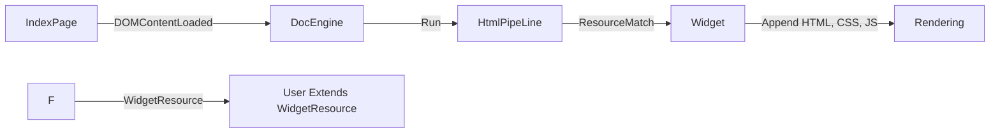
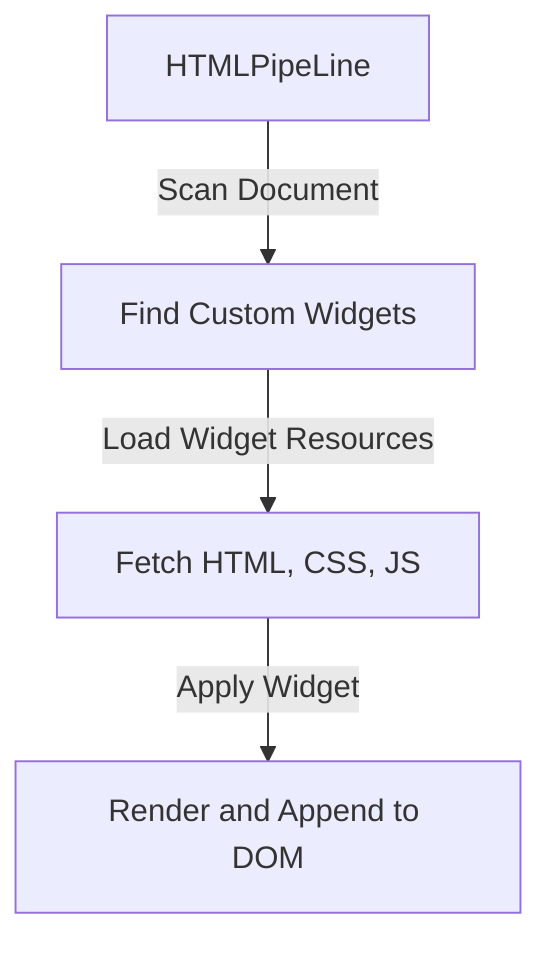
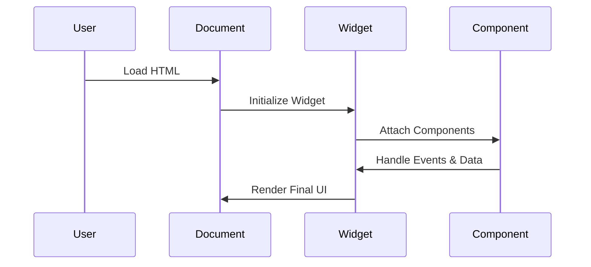
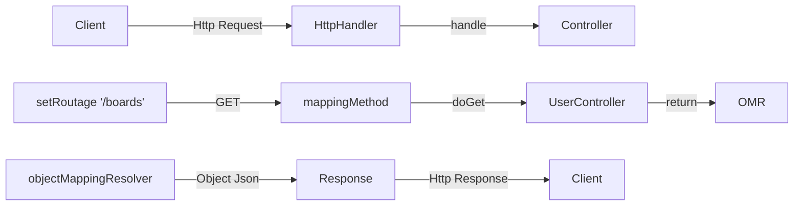
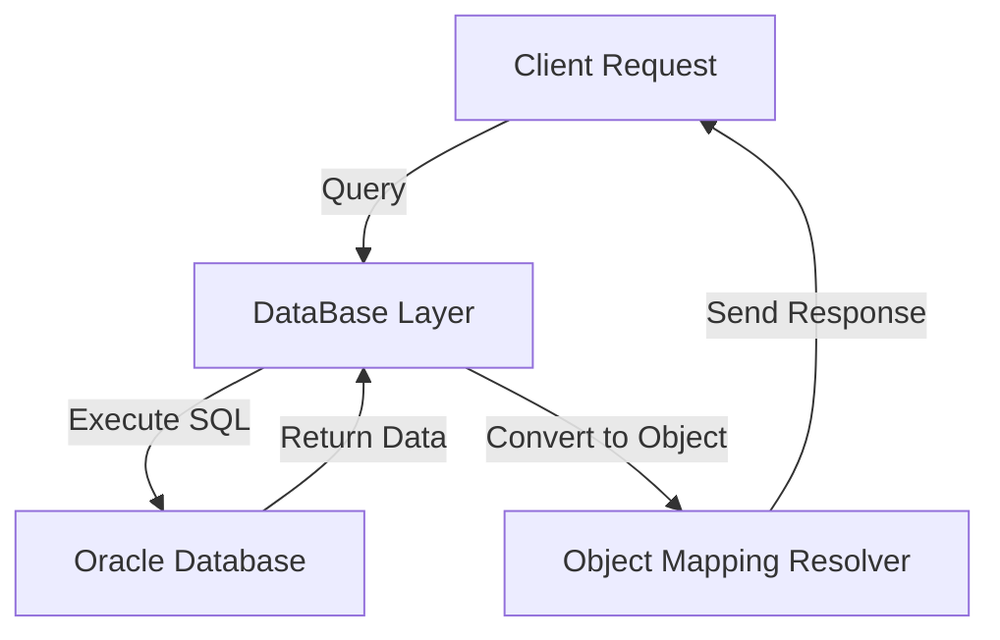
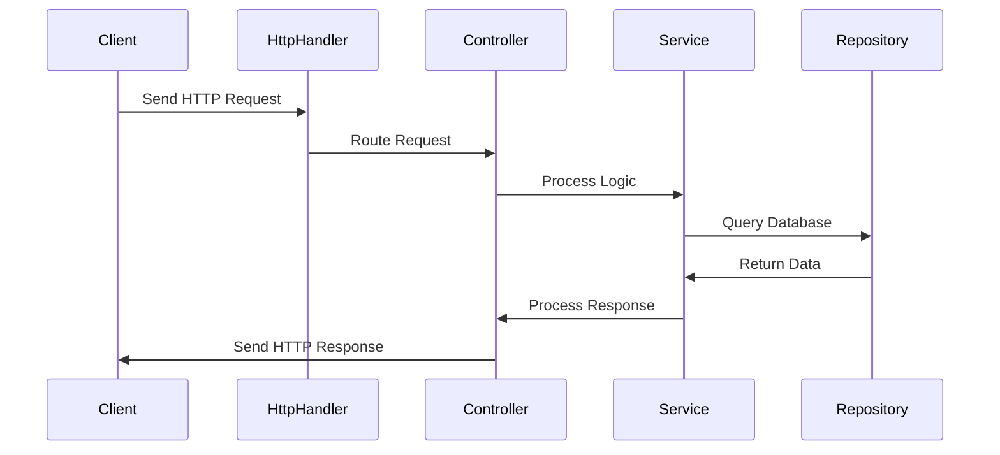

# Slate & Winter Project

## 📚 목차
- [Slate](#slate)
  - [프로젝트 소개](#slate-프로젝트-소개)
  - [핵심 기능](#slate-핵심-기능)
  - [기술 구조](#slate-기술-구조)
  - [상세 구현](#slate-상세-구현)
  - [프로젝트 회고](#slate-프로젝트-회고)
- [Winter](#winter)
  - [프로젝트 소개](#winter-프로젝트-소개)
  - [핵심 기능](#winter-핵심-기능)
  - [기술 구조](#winter-기술-구조)
  - [상세 구현](#winter-상세-구현)
  - [프로젝트 회고](#winter-프로젝트-회고)

---

## Slate

### Slate 프로젝트 소개
Slate는 프론트엔드 뷰 동적 제작을 도와주는 프레임워크입니다. 바닐라 JavaScript의 본질을 유지하면서도 효율적인 웹 개발을 가능하게 하는 것이 특징입니다.

#### 주요 특징
- HTML, CSS, JavaScript를 하나의 단위로 묶어 '위젯'으로 관리
- 순수 바닐라 기반 구현으로 외부 의존성 없음
- 컴포넌트 기반 재사용 가능한 구조
- 동적 렌더링 및 리소스 관리 시스템

### Slate 기술 구조

#### Slate 전체 프로세스 플로우

1. 인덱스 페이지에서 `DOMContentLoaded` 이벤트 발생
2. `DocEngine` 실행 후, `HtmlPipeLine`이 사용자 정의 위젯 태그 확인
3. 위젯을 로드(HTML, CSS, JS) 후 문서에 부착
4. 사용자는 위젯 리소스를 확장하여 객체를 정의
5. `Component`를 부착하여 Slate 내에서 기능 확장

#### HTMLPipeLine 흐름

#### Widget Lifecycle

### Slate 프로젝트 회고
#### 💡 좋았던 점
- 기존 HTML 구조를 유지하면서도 동적으로 조작할 수 있는 방식 설계
- 위젯 기반 구조를 적용하여 유연한 확장 가능

#### ❌ 아쉬운 점
- 위젯 내부에 또 다른 위젯을 고려하지 못하여 구조가 다소 복잡해짐
- CSS 스타일 통합 시 복잡한 선택자를 고려하지 못함

---

## Winter

### Winter 프로젝트 소개
Winter는 Spring Framework의 핵심 개념을 학습하고 이해하기 위해 만든 'Fake Spring' 프로젝트입니다. Java의 기본 HTTP 서버 모듈을 사용하여 Spring과 유사한 구조의 웹 서버를 구현했습니다.

#### 주요 특징
- Java HTTP 서버 모듈 기반 구현
- Spring과 유사한 구조의 컨트롤러 시스템
- 데이터베이스 연동 및 ORM 유사 기능
- 공통 로직의 추상화

### Winter 기술 구조

#### Winter 전체 프로세스 플로우

#### 데이터베이스 연동 흐름

#### 컨트롤러 처리 흐름

### Winter 프로젝트 회고
#### 💡 좋았던 점
- Spring의 구조를 직접 구현하면서 개념을 깊이 이해할 수 있었음
- JSON 직렬화 및 정적 리소스 제공 기능을 직접 개발해본 경험

#### ❌ 아쉬운 점
- 컨트롤러 내부 클래스로만 처리하여 구조가 다소 경직됨
- SQL을 코드 내에 직접 작성하여 유지보수가 어려워질 가능성 존재

---

## 추가 정보

### 사용 기술
- **프로그래밍 언어**: Java, JavaScript
- **라이브러리 및 프레임워크**: Ojdbc, Lombok, Jackson, Matter.js

### 구현 기능
#### 공통 기능
- 회원가입, 로그인
- 게시판 작성, 삭제
- 코멘트 작성
- 프로필 이미지 파일 업로드
- 스토어 아이템 등록
- REST API 설계 및 개발

#### Slate
- 동적 렌더링

#### Winter
- 오라클 DB 연동

### 프로젝트 미디어

### 프로젝트 링크
- **GitHub**: [슬레이트-윈터 프로젝트](https://github.com/gtypeid/slate-winter.git)
- **발표 자료**: [Google Slides](https://docs.google.com/presentation/d/1ZeOPq-6PRY6_joYS3ArO-okQF4NZ23CP/edit?usp=sharing&ouid=109390394369097049050&rtpof=true&sd=true)

이 리드미 파일은 Slate와 Winter의 주요 개념, 기술 구조 및 상세 구현 내용을 포함합니다. 추가 수정이 필요하면 알려주세요!

