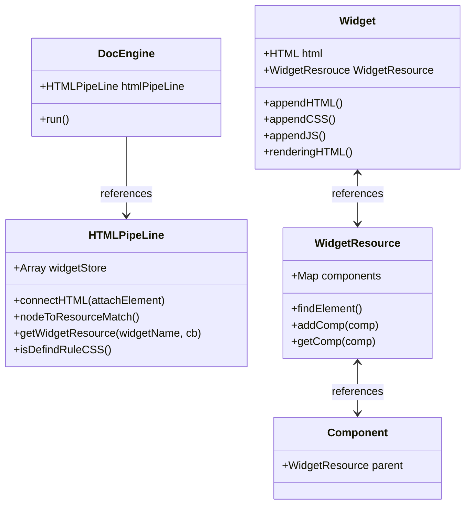
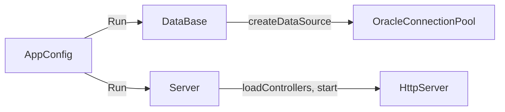

## 📚 목차
- [Slate](#slate)
  - [프로젝트 소개](#slate-소개)
  - [핵심 기능](#slate-핵심-기능)
  - [기술 구조](#slate-기술-구조)
  - [상세 구현](#slate-상세-구현)
  - [프로젝트 회고](#slate-프로젝트-회고)
- [Winter](#winter)
  - [프로젝트 소개](#winter-소개)
  - [핵심 기능](#winter-핵심-기능)
  - [기술 구조](#winter-기술-구조)
  - [상세 구현](#winter-상세-구현)
  - [프로젝트 회고](#winter-프로젝트-회고)

---

## Slate

### Slate 소개
Slate는 프론트엔드 뷰 동적 제작을 도와주는 프레임워크입니다. 바닐라 JavaScript의 본질을 유지하면서도 효율적인 웹 개발을 가능하게 하는 것이 특징입니다.

#### 주요 특징
- HTML, CSS, JavaScript를 하나의 단위로 묶어 '위젯'으로 관리
- 순수 바닐라 기반 구현으로 외부 의존성 없음
- 컴포넌트 기반 재사용 가능한 구조
- 동적 렌더링 및 리소스 관리 시스템

### Slate 핵심 기능

#### 위젯 시스템
- HTML, CSS, JS 파일을 하나의 위젯으로 통합 관리
- 동적 렌더링 및 컴포넌트 기반 구조
- 재사용 가능한 객체 지향적 설계

#### 리소스 관리
- 동적 리소스 로딩
- 캐싱 시스템
- CSS 클래스 충돌 방지 매커니즘

#### 컴포넌트 시스템
- 확장 가능한 컴포넌트 구조
- 이벤트 핸들링
- REST 통신 바인딩
- 엔티티 생성 관리

### Slate 기술 구조

#### 핵심 클래스 구조


### Slate 상세 구현

#### HTMLPipeLine 구현
```javascript
nodeToResourceMatch() {
    for(let it of this._docNodeStore) {
        const key = it[0];
        const value = it[1];
        for(let i = 0; i < value.length; ++i) {
            this.getWidgetResource(key, (resource) => {
                const widget = this.spawnWidget(resource.key, value[i], i);
                widget.rendering();
            });
        }
    }
}
```

### Slate 프로젝트 회고
#### 💡 좋았던 점
- 기존 HTML 구조를 유지하면서도 동적으로 조작할 수 있는 방식 설계
- 위젯 기반 구조를 적용하여 유연한 확장 가능

#### ❌ 아쉬운 점
- 위젯 내부에 또 다른 위젯을 고려하지 못하여 구조가 다소 복잡해짐
- CSS 스타일 통합 시 복잡한 선택자를 고려하지 못함

---

## Winter

### Winter 소개
Winter는 Spring Framework의 핵심 개념을 학습하고 이해하기 위해 만든 'Fake Spring' 프로젝트입니다. Java의 기본 HTTP 서버 모듈을 사용하여 Spring과 유사한 구조의 웹 서버를 구현했습니다.

#### 주요 특징
- Java HTTP 서버 모듈 기반 구현
- Spring과 유사한 구조의 컨트롤러 시스템
- 데이터베이스 연동 및 ORM 유사 기능
- 공통 로직의 추상화

### Winter 핵심 기능

#### 서버 시스템
- HTTP 요청/응답 처리
- 라우팅 시스템
- 컨트롤러 기반 구조

#### 데이터베이스 연동
- Oracle 데이터베이스 연동
- Connection Pool 관리
- SQL 쿼리 자동화

### Winter 기술 구조

#### 시스템 구조


#### 요청 처리 흐름
```mermaid
flowchart LR
    A[Client] -->|Http Request| B[HttpHandler]
    B --> |handle| C[Controller]
    D[setRoutage("/boards")] --> |"GET" | E[mappingMethod]
    E --> |doGet| F[UserController]
    F --> |return| G[OMR]
    H[objectMappingResolver] --> |"Object(Json)"| I[response]
    I -->|Http Response| J[Client]
```

### Winter 상세 구현

#### Controller 구현 예시
```java
public class UserGetController extends Controller implements Get {
    @Override
    public ControllerProperties getProperties() {
        return new ControllerProperties()
                .setRoutage("/user/");
    }
    @Override
    public User doGet(HttpExchange exchange) {
        PathVariable pathVariable = pathVariable(exchange);
        String uuid = pathVariable.value.get(0);
        String sql = "SELECT * FROM app_user WHERE uuid = ?";
        List<User> user = db.sqlQuery(sql, User.class, uuid);
        return user.get(0);
    }
}
```

### Winter 프로젝트 회고
#### 💡 좋았던 점
- Spring의 구조를 직접 구현하면서 개념을 깊이 이해할 수 있었음
- JSON 직렬화 및 정적 리소스 제공 기능을 직접 개발해본 경험

#### ❌ 아쉬운 점
- 컨트롤러 내부 클래스로만 처리하여 구조가 다소 경직됨
- SQL을 코드 내에 직접 작성하여 유지보수가 어려워질 가능성 존재

이 리드미 파일은 Slate와 Winter의 주요 개념, 기술 구조 및 상세 구현 내용을 포함합니다. 추가 수정이 필요하면 알려주세요!

